<table align="center">
  <tr>
    <td>You are visitor</td>
    <td></td>
  </tr>
</table>

<table>
  <tr>
    <th align="center">A little bit about me</th>
    <th align="center">What I'm listening to</th>
  </tr>
  <tr>
    <td align="center">
      </img>
    </td>
    <td align="center">
      </img>
    </td>
  </tr>
</table>

  

# Social

# Stats

  
</a>

# Skills
## DevOps

## Languages & Frameworks

 

# Worth looking at

</img>
